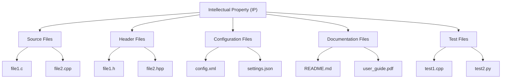
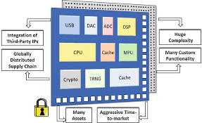
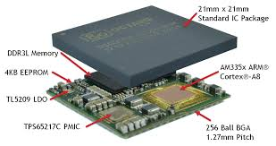

# Intellectual Property (IP) Composition
The following flowchart illustrates the structure of an Intellectual Property (IP) that is composed of several files. Each file serves a specific purpose and contributes to the overall functionality of the IP.



## Image 1 - diagram


## Documentation file
[doc.pdf](./doc/doc.pdf)

## Example of module
The following is an example of a module that can be used in the IP. This module is written in Verilog. 

```Verilog
module top;
    reg clk;
    reg [7:0] data;
    wire [7:0] result;

    // Instantiate the unit under test (UUT)
    sample uut (
        .clk(clk),
        .data(data),
        .result(result)
    );

    initial begin
        // Initialize Inputs
        clk = 0;
        data = 8'hFF;

        // Wait 100 ns for global reset to finish
        #100;

        // Add stimulus here
    end

    always begin
        #5 clk = ~clk;
    end

endmodule
```

## Image 2 - diagram

